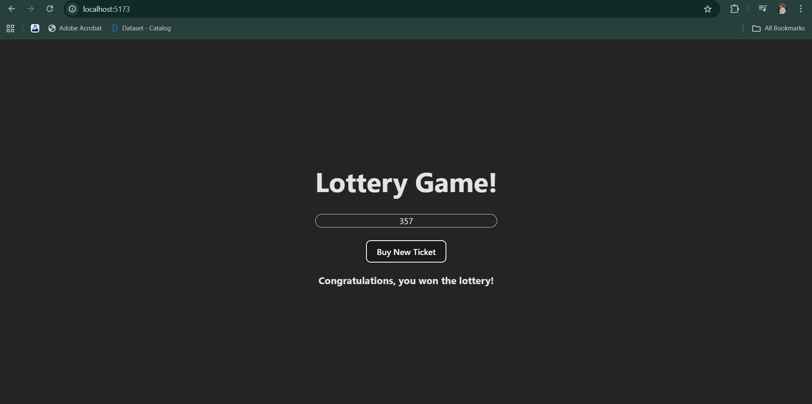

# 🎰 Lottery Game


---

## 📌 Overview
A simple **Lottery Game** built with **React + Vite**.  
The game generates a **3-digit lottery ticket** and checks if the **sum of the digits = 15**.  
If yes 🎉 → You win!  
If not ❌ → Try again.  

---

## 📂 Project Structure
```
Lottery-Game/
│── public/ # Public assets
│ └── vite.svg
│
│── src/ # Source code
│ ├── assets/ # Project assets (images, etc.)
│ ├── App.jsx # Root component
│ ├── App.css # App styles
│ ├── Lottery.jsx # Lottery game logic & UI
│ ├── Lottery.css # Lottery component styles
│ ├── helper.js # Utility functions (ticket generator, sum)
│ ├── index.css # Global styles
│ └── main.jsx # App entry point
│
│── index.html # HTML entry point
│── package.json # Dependencies & scripts
│── vite.config.js # Vite configuration
│── eslint.config.js # ESLint configuration
│── README.md # Project documentation
```

---

## 🎮 Features

- 🎟️ Generate random **3-digit tickets**  
- ➕ Calculate sum of digits  
- 🏆 Win if the **sum = 15**  
- 🔄 Buy a new ticket anytime  
- 🎨 Styled with CSS for a clean UI  

---


## 🛠️ Tech Stack
- **React** ⚛️  
- **Vite** ⚡  
- **CSS3** 🎨  

---

## ▶️ How to Run Locally

### 1️⃣ Clone the repo
```bash
git clone https://github.com/AnupPandey04/Lottery-Game.git
cd Lottery-Game
```
2️⃣ Install dependencies
```bash
npm install
```
3️⃣ Start the app
```bash
npm run dev
```
## 📸 Demo Preview


---

## 📌 Future Improvements (TODO)

- [ ] Allow user to set ticket length (n digits)
- [ ] Add multiple winning conditions
- [ ] Display winning history
- [ ] Improve UI with animations

---
## 📜 License

This project is licensed under the MIT License.  
You’re free to use, modify, and distribute it.
